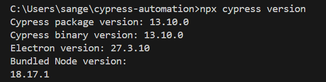
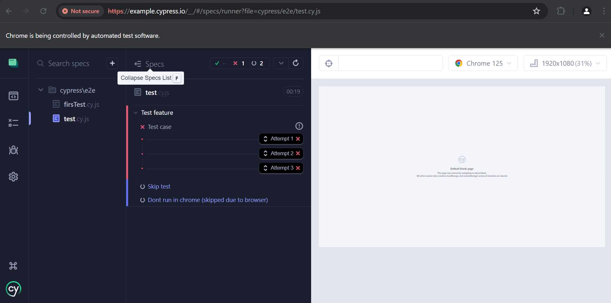

# Pre-requisites : 
Download the below version 
node: 'v19.9.0',
npm: '9.6.3' 
cypress 
# Run cypress for first time 

# Test retries 

# ToDo 
1. EsLint https://github.com/cypress-io/eslint-plugin-cypress